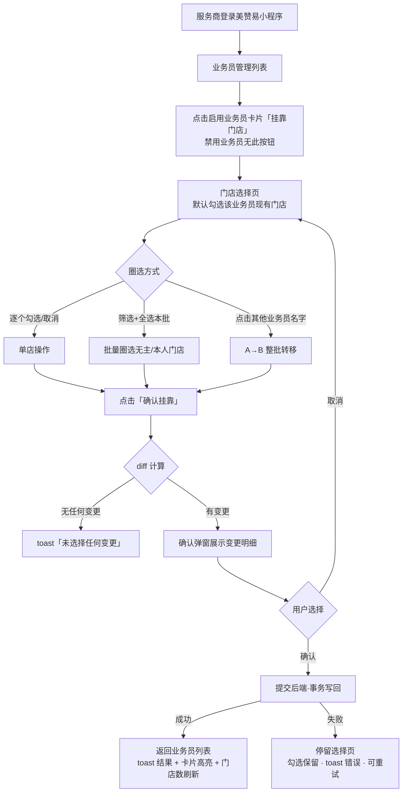

# 美赞易小程序 V3.5.0 PRD：服务商·业务员挂靠门店批量调整（一般贸易）

## 文档信息

| 项 | 内容 |
|---|---|
| 产品 | 美赞易小程序（服务商端） |
| 功能模块 | 业务员管理 → 挂靠门店 |
| 文档版本 | V3.5.0 |
| 产品经理 | 陈银玲 |
| 编写日期 | 2026-09-05 |
| 状态 | 待评审 |
| 版本范围 | 仅调整**一般贸易**服务商下的一般贸易门店与一般贸易业务员的挂靠关系；**保税贸易相关一律不动**（见 2.3 非目标） |
| 关联原型 | `服务商小程序端_业务员批量挂靠.html`（可交互高保真原型，含 320 家门店演示数据） |
| 变更记录 | V3.5.0（2026-09-05）首次成稿；同日现状校准：小程序已有单店调整入口，本次为**新增批量调整**能力；同日规则确认（原 Q2/Q10）：**待审核门店可调整归属**；**禁用业务员不展示入口按钮、不允许调整** |

---

## 1. 背景与用户痛点

### 1.1 业务背景

服务商登录美赞易小程序可管理门店、新增业务员。门店与业务员的挂靠关系当前已有两条维护路径：PC 后台（门店编辑中的「一般贸易业务员」字段），以及**小程序端已有的单店调整入口**（一次调整一家门店）。两条路径均可用，但小程序端**只能逐个调整、没有批量能力**——服务商名下门店多达几百家时，逐店重复操作效率极低。

挂靠关系现状模型（与 PC 后台一致，本期不改变模型，仅新增小程序端**批量**调整能力）：

- 一家门店同一时刻只挂靠 **1 名**业务员（一店一人）；
- 服务商规模大的名下有**几百家门店**，逐店调整（PC 或小程序单店入口均如此）效率极低。

### 1.2 用户痛点

| # | 痛点 | 现状表现 |
|---|---|---|
| P1 | 批量派店效率低 | 新业务员入职分配几十家门店，小程序单店入口需逐家点开、重复操作几十次；PC 端同样逐店编辑，均需半小时以上 |
| P2 | 无主门店批量分配难 | 新建门店、业务员离职后回落的门店处于"无主"状态，现有单店入口可分但只能一家一家分，积压难清 |
| P3 | 离职/调岗交接难 | A 业务员离职，名下几十上百家门店要转给 B，只能逐店改归属，重复操作且易漏 |
| P4 | 挂靠关系不可见 | 小程序端业务员卡片不显示名下门店数量，服务商无法快速掌握分工现状 |

---

## 2. 目标与非目标

### 2.1 业务目标

| # | 目标 | 说明 |
|---|---|---|
| G1 | 批量挂靠无主门店 | 服务商可在小程序端将「无业务员的门店」**批量**挂靠给指定业务员（现有单店入口仅支持逐个） |
| G2 | 批量解除挂靠关系 | 服务商可在小程序端一次解除业务员与部分/全部门店的挂靠关系，门店回落为无主（单个解除现有入口已支持，本次补批量场景） |
| G3 | 批量 A→B 转移 | 服务商可将 A 业务员名下门店**整批**调整给 B 业务员（离职/调岗交接） |

### 2.2 产品目标与衡量指标

| 指标 | 现状 | 目标 |
|---|---|---|
| 单次挂靠调整操作时长 | 小程序单店入口 / PC 逐店操作，100 家门店约 30 分钟 | 批量调整 3 步内完成，≤1 分钟（基线数据待补） |
| 无主门店处理率 | 可分但只能逐个，处理慢、易积压 | 上线后无主门店占比环比下降（口径待与业务方确认） |
| 离职交接完成时长 | 逐店转移，小时级 | 整批转移，分钟级 |

### 2.3 非目标（本次不做）

| # | 不做的事 | 说明 |
|---|---|---|
| N1 | **保税贸易全部场景** | 保税贸易服务商下的门店与保税贸易业务员，本次不提供任何挂靠调整能力（入口不投放） |
| N2 | 追加式多业务员共管 | 不做"一家门店同时挂多名业务员"，维持一店一人 |
| N3 | 门店列表页镜像入口 | 挂靠入口仅放业务员列表，门店列表不加 |
| N4 | 业务员管理功能改造 | 新增/编辑/重置密码/禁用业务员为现有逻辑，不做改动 |
| N5 | PC 后台改造 | PC 端挂靠维护能力维持现状 |
| N6 | 挂靠变更审批流 | 不加审批，服务商操作即时生效 |
| N7 | 操作日志前端查询页 | 后端记录操作流水（见 8.1），前端查询入口本期不做 |
| N8 | **小程序现有单店调整功能** | 现有逐个调整入口与逻辑保持现状不动；本次新增的业务员列表批量入口与之**并存**，不替代、不改造 |

---

## 3. 用户角色与用户故事

### 3.1 用户角色

| 角色 | 说明 | 与本功能关系 |
|---|---|---|
| 服务商（一般贸易） | 登录美赞易小程序，管理名下门店与业务员 | **操作者**：发起挂靠/解除/转移 |
| 业务员 | 被挂靠门店的负责人 | **被影响方**：不操作，归属变更后生效；是否通知见 Q6 |
| 保税贸易服务商 | 登录美赞易小程序的保税贸易类型服务商 | 本期**不可见**挂靠入口 |

### 3.2 用户故事与验收标准

**US-01 批量挂靠无主门店**
> 作为一名一般贸易服务商，我希望在业务员列表为某业务员批量勾选无主门店并一次提交，以便新业务员入职后快速完成派店。

验收标准：
- AC1：启用状态业务员卡片展示「挂靠门店 N 家」与「挂靠门店」按钮，点击进入门店选择页；**禁用业务员卡片不展示该按钮**；
- AC2：选择页支持按「无主」筛选，且「全选本批(N)」一次勾选当前筛选下全部可挂靠门店；
- AC3：确认后门店归属变为该业务员，业务员卡片门店数同步 +N；
- AC4：待审核门店可正常勾选挂靠；百宝箱开通中门店不可勾选、不入全选本批，点击有 toast 提示。

**US-02 批量转移（A→B）**
> 作为一名一般贸易服务商，我希望把 A 业务员名下门店整批转给 B 业务员，以便离职/调岗时分钟级完成交接。

验收标准：
- AC1：进入 B 的挂靠页，归属筛选行直接列出其他**启用状态**有门店的业务员名字及门店数（如「林允儿 88」），禁用业务员不出现；
- AC2：点击 A 的名字后，A 名下全部可挂门店被自动勾选，并提示"确认后将整批转移给 B"；
- AC3：确认后 A 名下可挂门店全部转为 B（A 归零或仅剩不可挂门店），B 卡片门店数同步累加；
- AC4：转移过程中 B 自有名下门店勾选保持不变，确认后不被解除；
- AC5：已在 A 转移视角再点 C，A 的勾选自动清除、切换为 C，不发生多人门店叠加转移。

**US-03 解除挂靠关系**
> 作为一名一般贸易服务商，我希望解除业务员与部分或全部门店的挂靠关系，以便门店回落无主后重新分配。

验收标准：
- AC1：进入业务员挂靠页，其现有门店默认勾选；取消勾选后底部提示"将解除 N 家现有挂靠"；
- AC2：取消全部勾选（纯解除）允许提交，确认弹窗仅列解除明细；
- AC3：确认后对应门店归属清空（无主），业务员卡片门店数同步刷新。

**US-04 掌握挂靠现状**
> 作为一名一般贸易服务商，我希望不进操作也能看到每个业务员管多少家店、某家门店归谁管，以便快速判断分工是否合理。

验收标准：
- AC1：业务员列表每张卡片展示挂靠门店数量；
- AC2：门店选择页每张门店卡片展示归属状态（已挂靠给本人 / 当前由他人负责 / 尚未挂靠），三态视觉可区分。

**US-05 快速定位门店**
> 作为一名拥有几百家门店的服务商，我希望通过搜索与筛选快速圈定目标门店，以便不逐屏翻找。

验收标准：
- AC1：支持按门店名称/地址模糊搜索；
- AC2：归属筛选（全部/无主/本人/指定其他业务员）与搜索、全选本批联动，按钮 N 值实时更新。

---

## 4. 核心业务流程

### 4.1 主流程

### 4.2 流程步骤说明

| 步骤 | 节点 | 规则 |
|---|---|---|
| 1 | 进入选择页 | 门店列表 = 该服务商名下**全部一般贸易门店**；该业务员现有门店默认勾选 |
| 2 | 圈选 | 三种方式可混用；勾选他人门店=接管，取消本人门店=解除 |
| 3 | diff 计算 | 前端按「勾选集合 vs 原归属」计算 keep/接管/新挂/解除四类 |
| 4 | 确认弹窗 | 展示明细（>5 家折叠为计数行），用户取消则留在选择页 |
| 5 | 提交 | 后端事务执行；成功返回列表，失败保留现场可重试 |

### 4.3 A→B 整批转移子流程

### 4.4 前置状态定义

| 对象 | 状态 | 可挂靠性 |
|---|---|---|
| 门店 | 启用 | ✅ 可挂靠/可被转移 |
| 门店 | 待审核 | ✅ 可挂靠/可被转移（与启用一致，业务方 2026-09-05 确认） |
| 门店 | 百宝箱开通中 | ❌ 禁挂、禁入批 |
| 门店归属 | 无主 / 本人 / 他人 | 均可操作，语义见 5.3.2 |
| 业务员 | 启用 | ✅ 可作为接收方与转移来源 |
| 业务员 | 禁用 | ❌ 不展示「挂靠门店」按钮，不可作为接收方，亦不出现在转移来源 chips 中；名下门店如需调整须先启用该业务员 |

---

## 5. 功能详细需求

### 5.1 功能点总览

| 模块 | 功能点 | 新增/存量 |
|---|---|---|
| 业务员列表页 | 挂靠门店数量展示 | 新增 |
| 业务员列表页 | 「挂靠门店」入口按钮 | 新增 |
| 门店选择页 | 门店列表（含归属标识） | 新增 |
| 门店选择页 | 归属筛选 + 搜索 | 新增 |
| 门店选择页 | 全选本批 / 取消本批 | 新增 |
| 门店选择页 | A→B 整批转移（他人业务员 chips） | 新增 |
| 确认弹窗 | 变更明细核对（diff 四类 + 折叠） | 新增 |
| 结果反馈 | 三态结果文案 + 门店数刷新 | 新增 |
| 业务员管理 | 新增/编辑/重置密码/禁用 | 存量不动 |
| 门店维度 | 单店调整挂靠入口（现有） | 存量不动，与本次批量入口并存 |

### 5.2 业务员列表页（入口）

**投放范围**：仅服务商类型 = 一般贸易的服务商账号可见；保税贸易服务商不可见本入口。

**业务员卡片新增元素：**

| 元素 | 类型 | 展示规则 |
|---|---|---|
| 挂靠门店数量 | 文本 | `挂靠门店 N 家`，N = 该业务员名下一般贸易门店数（后端聚合，实时）；启用/禁用业务员均展示 |
| 挂靠门店按钮 | 主操作按钮 | **仅启用状态业务员展示，禁用业务员卡片不展示**；卡片操作区内，样式区别于「编辑」「重置密码」；点击进入门店选择页 |

**按钮点击 → 进入门店选择页，传参：**

| 参数 | 来源 |
|---|---|
| 业务员 ID | 卡片上下文（接口层校验须为启用状态，禁用返回业务码拒绝，防绕过） |

### 5.3 门店选择页

#### 5.3.1 页面结构

| 区块 | 内容 |
|---|---|
| 顶部提示条 | 「当前业务员：XXX（替换式）」+ 规则简述 |
| 归属筛选行 | `全部 / 无主 / 本人 / 【其他业务员名字 N】`；他人业务员为动态 chips（橙色 + 名字 + 门店数徽标，按门店数降序），**当前业务员本人不出现**；仅列出**启用状态**业务员，**禁用业务员不出现**（不可被转出，名下门店如需调整须先启用） |
| 搜索框 | 按门店名称/地址模糊搜索 |
| 门店卡片列表 | 门店名称、状态、联系人、电话、地址 + 归属提示行（见 5.3.2）；卡片可勾选/取消 |
| 底部操作栏 | 左：已选门店数 + 动态状态提示（见 5.7.1）；右：「确认挂靠」主按钮 |

> 说明：本期仅一般贸易，列表**不展示贸易模式 Tab**（数据源已限定为一般贸易门店，保税门店即使存在也不展示）。

#### 5.3.2 归属提示行三色语义（门店卡片）

| 归属状态 | 展示 | 默认勾选 | 勾选/取消语义 |
|---|---|---|---|
| 本人门店（绿） | 「已挂靠给 XXX」 | ✅ 进入页面默认勾选 | 取消勾选 = **解除挂靠** |
| 他人负责（橙） | 「当前由 XXX 负责，勾选后将转由本人接管」 | ❌ | 勾选 = **接管**（原业务员自动失去该店） |
| 未挂靠/无主（灰） | 「尚未挂靠业务员」 | ❌ | 勾选 = **新挂靠** |
| 不可挂靠（置灰禁选） | 百宝箱开通中 | — | 点击 toast 拦截（见 6.2）；**待审核门店可正常勾选挂靠，不置灰** |

### 5.4 快速圈选能力（面向几百家门店）

| 能力 | 规则 |
|---|---|
| 全选本批(N) | 将当前「归属筛选 + 搜索」条件下**可见且可挂靠**的门店全部勾选（**含待审核门店**）；百宝箱开通中永不入批；无可挂门店时 toast「当前筛选下没有可挂靠的门店」 |
| 取消本批(N) | 已全选时按钮切换为「取消本批(N)」，一次撤销本批勾选 |
| N 实时更新 | 按钮文案随筛选条件变化实时显示可入批门店数 |

> ⚠️ 语义宣导点：替换式模型下，若当前筛选为「本人」，点「取消本批」= 撤销本人全部门店勾选 = 确认后**解除全部挂靠**。属预期行为，底部提示 + 确认弹窗双重兜底。

### 5.5 A→B 整批转移（他人业务员 chips）

| # | 规则 |
|---|---|
| T1 | 点击归属筛选行中的他人业务员名字（如「林允儿 88」）= 进入该业务员的整批转移视角 |
| T2 | 系统自动勾选 TA 名下**全部可挂门店**（不可挂门店跳过），toast「已勾选 X 名下 N 家门店，确认后将整批转移给 B」 |
| T3 | **每次锁定单一转移来源**：处于 A 的转移视角时再点 C，A 的勾选自动清除、切换为 C，避免多人门店叠加误转移 |
| T4 | **B 本人现有门店勾选全程不动**（keep 保护）：切来源、切视角均不误触发解除 |
| T5 | 转移视角下，门店卡片归属文案变更为「确认后将**整批转移**给 B」 |
| T6 | 转移视角下仍可手动增删勾选（在 A 的门店范围内微调）；切回「全部/无主/本人」视角不清空已有勾选 |

### 5.6 确认弹窗（变更明细核对）

点击「确认挂靠」后弹出，展示本次提交 diff：

| 变更类型 | 标识 | 含义 |
|---|---|---|
| 保留 | ◆ | 保持本人现有挂靠（计数行展示） |
| 接管 | ▲ | 门店原由其他业务员负责，将转由本人负责 |
| 新挂靠 | ＋ | 原无主门店，新挂靠给本人 |
| 解除 | － | 取消勾选的原本人门店，将解除挂靠 |

**折叠规则**：同类变更 ≤ 5 条逐条列出（接管明细含原业务员姓名）；**> 5 条折叠为计数行**（如「接管门店 129 家（原由 3 名业务员负责）」）。

**弹窗固定元素**：

| 元素 | 内容 |
|---|---|
| 风险提示行 | 「挂靠后将由 XXX 负责以上门店，原业务员将不再负责，请确认。」 |

**可确认条件**：接管/新挂靠/解除任一不为空。无任何变更时 toast「未选择任何变更」。

### 5.7 提交与结果反馈

#### 5.7.1 底部栏动态提示（选择页内实时）

| 状态 | 按钮态 | 提示文案 |
|---|---|---|
| 未勾选任何门店且无解除 | 禁用 | 请至少勾选 1 家门店 |
| 纯解除（全部取消） | 可用 | 将解除全部 N 家现有挂靠 |
| 勾选含他人门店 | 可用 | 含 N 家将接管他人门店 |
| 含解除操作 | 可用 | 将解除 N 家现有挂靠 |
| 常规 | 可用 | 替换式：挂靠后覆盖现有门店 |

#### 5.7.2 提交与落库

1. 确认后按钮 loading，提交挂靠变更；
2. 后端事务写回（规则见 5.9）；
3. 成功：返回业务员列表，toast 三态文案：

| 场景 | 文案 |
|---|---|
| 挂靠 + 解除 | 已为 XXX 挂靠 N 家、解除 K 家门店 |
| 仅挂靠（含接管） | 已为 XXX 挂靠 N 家门店（接管 M 家） |
| 仅解除 | 已为 XXX 解除 K 家门店挂靠 |

4. 列表中该业务员卡片高亮，挂靠门店数量同步刷新；
5. 失败：停留选择页，勾选状态保留，toast 错误原因，可重试或返回。

### 5.8 接口定义（输入/输出）

#### 5.8.1 业务员列表（存量接口扩展）

`GET /miniapp/seller/staff/list`

| 输出字段 | 类型 | 说明 |
|---|---|---|
| staffId | string | 业务员 ID |
| staffName / account / status | string | 现有字段 |
| **storeCount（新增）** | int | 名下一般贸易门店数，实时聚合 |

#### 5.8.2 可选择门店列表

`GET /miniapp/seller/staff/{staffId}/bindable-stores`

| 输出字段 | 类型 | 说明 |
|---|---|---|
| storeId / storeName / status / contact / phone / address | - | 门店基础信息（仅一般贸易门店） |
| ownerStaffId | string\|null | 当前归属业务员；null = 无主 |
| ownerStaffName | string\|null | 冗余展示字段 |
| bindable | boolean | 是否可挂靠：百宝箱开通中 = false，其余状态（含**待审核**）= true |

#### 5.8.3 提交批量挂靠调整

`POST /miniapp/seller/staff/bind-adjust`

**输入：**

| 参数 | 类型 | 必填 | 说明 |
|---|---|---|---|
| staffId | string | 是 | 接收方业务员 ID |
| targetStoreIds | array\<string\> | 是 | 确认后该业务员名下应挂靠的**全量**门店 ID 集合（含保留门店）；纯解除传空数组 |
| clientDiff | object | 否 | 前端 diff 摘要（add/replace/remove 计数），仅用于日志与埋点比对 |

**输出：**

| 字段 | 类型 | 说明 |
|---|---|---|
| code | int | 0 成功；非 0 见错误码 |
| data.finalCount | int | 该业务员调整后门店数 |
| failList | array | 冲突明细（storeId + 原因），策略见 Q3 |

> 传全量集合而非增量：服务端按「全量集合 vs 数据库当前归属」计算真实 diff，天然幂等，防并发场景下重复执行。

### 5.9 数据写回规则

> 写回字段与现有维护路径（PC 后台门店编辑、小程序现有单店调整）**完全一致**，均为门店的「一般贸易业务员」归属字段；新旧入口操作的是同一份数据，无双入口数据不一致风险。

| 操作 | 写回 | 结果 |
|---|---|---|
| 新挂靠 / 接管 / 保留 | 门店.一般贸易业务员 ID = 接收方业务员 ID | 原业务员（如有）自动失去该店 |
| 解除 | 门店.一般贸易业务员 ID = 空 | 门店回落为无主 |
| 不涉及 | 门店.保税贸易业务员 ID | **本期任何操作不触碰该字段** |

---

## 6. 异常场景与边界 Case

### 6.1 交互边界

| # | 场景 | 处理 |
|---|---|---|
| E1 | 未勾选任何门店且无解除 | 「确认挂靠」禁用，提示「请至少勾选 1 家门店」 |
| E2 | 纯解除（清空全部门店） | **允许提交**，底部提示 + 确认弹窗仅列解除明细 |
| E3 | 勾选含他人门店 | 底部实时提示「含 N 家将接管他人门店」 |
| E4 | 当前筛选无可挂门店 | 点全选本批 toast「当前筛选下没有可挂靠的门店」 |
| E5 | 转移视角切换来源（A→C） | A 的勾选自动清除，仅保留 C 名下门店勾选 |
| E6 | 转移视角下 B 自有门店 | 勾选全程不动，确认后保留，不误解除 |
| E7 | 中途退出选择页再进入 | 勾选状态**不持久化**，按数据库当前归属重新初始化默认勾选 |
| E8 | 服务商名下无一般贸易门店 | 选择页空态：「暂无可挂靠门店」 |
| E9 | 大门店量（数百上千家） | 列表整页渲染（性能指标见 7.1）；确认弹窗按 5.6 折叠 |

### 6.2 拦截与提示规则

| 触发 | 提示文案 | 拦截方式 |
|---|---|---|
| 点击「百宝箱开通中」门店 | 该门店「百宝箱开通中」，暂不可挂靠业务员 | toast，卡片置灰禁选 |
| 无变更点确认 | 未选择任何变更 | toast |
| 禁用业务员（接收方） | —（入口按钮不展示，正常路径不可达） | **强拦截**：卡片不展示「挂靠门店」按钮；接口层校验 staffId 状态，禁用返回业务码拒绝（防绕过） |
| 保税贸易服务商访问 | 入口不可见 | 菜单级投放控制（前端 + 后端双重校验） |

> **待审核门店不做拦截**：可正常勾选挂靠、入全选本批、被整批转移（业务方 2026-09-05 确认，与现有单店入口规则对齐）。

### 6.3 服务端异常

| # | 场景 | 处理 |
|---|---|---|
| S1 | 并发冲突（他人同时在 PC 端或小程序现有单店入口调整同一门店） | 提交时后端校验归属；冲突策略（覆盖/报错）见 Q3，报错时返回冲突明细，前端提示刷新后重试 |
| S2 | 提交网络失败/超时 | 停留选择页，勾选保留，toast 错误原因，可重试 |
| S3 | 部分门店写回失败 | 整体事务回滚（不做半成功态），提示重试 |
| S4 | staffId 无效/无权限/**已禁用** | 返回业务码，前端 toast「操作失败，请刷新重试」并退出选择页 |

---

## 7. 非功能需求

### 7.1 性能

| 指标 | 要求 |
|---|---|
| 门店选择页首屏（300 家门店） | ≤ 1.5s |
| 搜索/筛选响应 | ≤ 300ms（前端本地过滤） |
| 全选本批（500 家）勾选反馈 | ≤ 500ms |
| 提交接口（单次 ≤ 500 家） | P95 ≤ 3s（以后端压测为准） |
| 单次提交上限 | 建议 500 家，超出前端拆批提示（Q1 待确认） |
| 确认弹窗渲染 | 折叠规则保证 DOM 行数与门店量解耦 |

### 7.2 埋点

| 事件名 | 触发时机 | 关键参数 | 用途 |
|---|---|---|---|
| bind_entry_click | 点击「挂靠门店」按钮 | staff_id, staff_status | 入口渗透 |
| bind_page_view | 选择页曝光 | store_total, mine_count | 使用率 |
| bind_search | 搜索 | keyword_len | 搜索依赖度 |
| bind_select_all | 全选本批 | batch_count, filter_type | 批量功能价值 |
| bind_transfer_click | 点击转移来源 chip | from_staff_id, store_count | A→B 转移使用率 |
| bind_confirm_view | 确认弹窗曝光 | add/replace/remove/keep 计数 | 操作结构分析 |
| bind_submit | 点确认提交 | diff 计数, total_stores | 核心转化 |
| bind_result | 提交结果 | success, fail_count, error_code | 成功率监控 |

### 7.3 权限

| 项 | 规则 |
|---|---|
| 入口可见性 | 服务商类型 = 一般贸易可见；保税贸易不可见（前端菜单 + 后端接口双重校验） |
| 操作权限 | 具备业务员管理权限的服务商账号（主账号默认具备；子账号权限矩阵见 Q5） |
| 数据范围 | 仅可操作本服务商名下门店与业务员，接口层校验归属 |
| 操作留痕 | 后端记录操作流水：操作人 / 时间 / 接收方业务员 / 门店清单 / diff 类型（前端查询入口本期不做） |

---

## 8. 依赖项、风险点与待确认问题

### 8.1 依赖项

| # | 依赖 | 责任方 | 说明 |
|---|---|---|---|
| D1 | 门店「一般贸易业务员」归属字段 | 后端 | 现有字段，写回复用 |
| D2 | 业务员 storeCount 聚合 | 后端 | 列表接口新增，实时聚合 |
| D3 | 批量挂靠提交接口（事务） | 后端 | 新接口，全量集合 diff 写回 |
| D4 | 服务商类型字段 | 后端 | 入口投放与数据过滤依据 |
| D5 | 操作流水记录 | 后端 | 审计依赖，本期只写不查 |
| D6 | 小程序现有单店调整接口 | 后端 | 存量依赖：批量接口与现有单店调整写回**同一归属字段**（见 5.9），保持规则一致；现有接口本身不做改动 |

### 8.2 风险点

| # | 风险 | 应对 |
|---|---|---|
| R1 | 误操作解除/接管影响面大 | 确认弹窗 diff 明细 + 风险提示行双重兜底；大批量折叠但保留计数 |
| R2 | 并发冲突（PC 端同时调整） | 全量集合提交 + 后端冲突校验（策略见 Q3） |
| R3 | 大服务商数据量（500+ 家） | 性能指标约束；上限拆批提示；后续版本可加分页/虚拟滚动 |
| R4 | 保税贸易服务商预期管理 | 上线公告/客服话术说明"保税贸易暂不支持，后续版本开放"（Q8） |

### 8.3 待确认问题

| # | 问题 | 当前假设 | 需确认方 |
|---|---|---|---|
| Q1 | 单次挂靠门店数上限 | 未设上限，建议 500，超出拆批提示 | 后端/业务方 |
| Q3 | 并发冲突策略 | 后端校验归属版本，冲突返回失败明细；不做静默覆盖 | 后端 |
| Q4 | 操作流水查询入口 | 本期后端记录、无前端入口 | 业务方（下版本） |
| Q5 | 子账号权限矩阵 | 具备业务员管理权限即可操作挂靠 | 业务方 |
| Q6 | 挂靠变更是否通知业务员 | 本期不通知 | 业务方 |
| Q7 | storeCount 统计口径 | 实时聚合，与门店侧归属一致 | 后端 |
| Q8 | 保税贸易版本计划 | 本期不做，入口不投放；是否置灰+敬请期待 由 UI 定 | 产品/业务方 |
| Q9 | 同一服务商名下是否可能混合一般/保税门店 | 假设不混合（服务商类型单一）；若存在混合数据，选择页按 trade=general 过滤展示 | 业务方 |

**已确认决策（2026-09-05 业务方拍板，原 Q2 / Q10 关闭）：**

| 原问题 | 结论 |
|---|---|
| Q2 禁用业务员作为挂靠接收方 | **禁止**：禁用业务员卡片不展示「挂靠门店」按钮，不允许调整；接口层同步强拦截（防绕过）。名下门店如需调整，须先启用该业务员 |
| Q10 与现有单店入口的规则对齐 | **待审核门店可调整归属**（放开，不再禁挂）；百宝箱开通中门店仍禁挂。禁用业务员规则同上，与现有单店入口保持一致 |

---

## 9. 验收场景清单（补充）

| # | 场景 | 预期结果 |
|---|---|---|
| V1 | 业务员列表入口展示 | 启用业务员卡片展示「挂靠门店 N 家」+「挂靠门店」按钮；**禁用业务员卡片不展示按钮（数量仍展示）** |
| V2 | 无主门店批量挂靠 | 筛「无主」→ 全选本批 → 确认，全部记为新挂靠，数量刷新 |
| V3 | 接管他人门店 | 勾选他人门店 → 确认，记为接管，原业务员失去该店 |
| V4 | 部分解除 | 取消部分本人门店 → 确认，记为解除 |
| V5 | 纯解除 | 取消全部 → 可提交，弹窗仅列解除明细，执行后清零 |
| V6 | A→B 整批转移 | 点 A 的 chip → 确认，A 清零（无可挂门店时）、B 累加 |
| V7 | 转移来源切换 | 点 A 再点 C，A 勾选清除，仅剩 C |
| V8 | B 自有门店保护 | 转移确认后 B 原有门店全部保留 |
| V9 | 待审核门店 | 可正常勾选、可入全选本批、可被整批转移，挂靠成功 |
| V9a | 百宝箱开通中门店 | 不可勾选、不入全选本批、点击有 toast |
| V9b | 禁用业务员调整拦截 | 卡片无「挂靠门店」按钮；绕过前端直接调接口（staffId=禁用业务员）返回业务码拒绝 |
| V10 | 大批量确认弹窗 | 同类变更 >5 家折叠为计数行 |
| V11 | 提交失败 | 停留原页、勾选保留、可重试 |
| V12 | 保税贸易服务商 | 不可见挂靠入口（前端+接口双重校验） |
| V13 | 中途退出重进 | 勾选不持久化，按当前归属重新初始化 |
